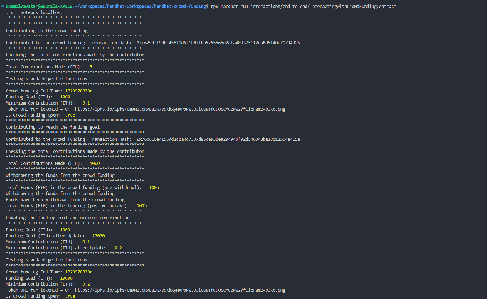
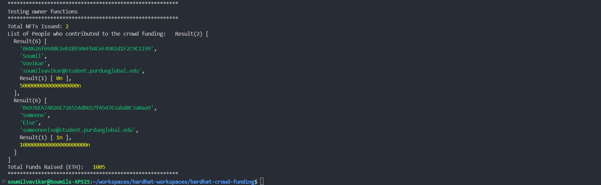

# End to End Testing

## Command

```shell
npx hardhat run interactions/end-to-end/InteractingWithCrowdFundingContract.js --network localhost
```

## Test Evidence(s)

The logs of the end to end tests are captured in [e2e-crowd-funding-test-evidence.txt](txtfiles/e2e-crowd-funding-test-evidence.txt) file.



