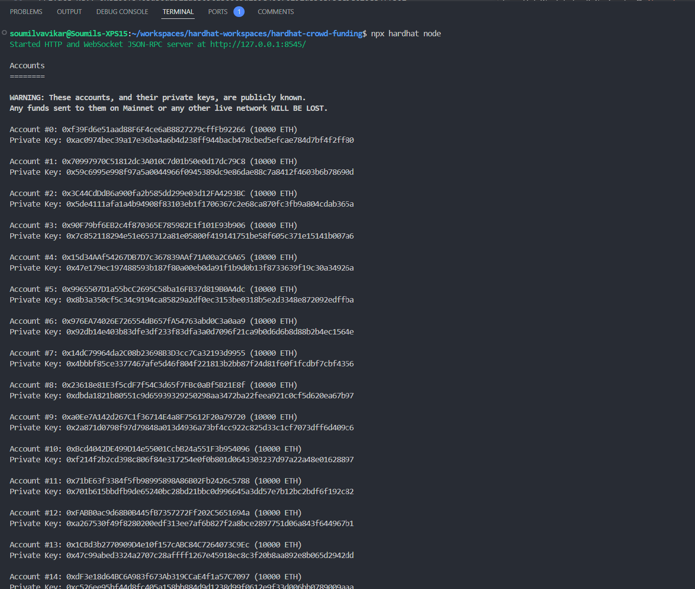
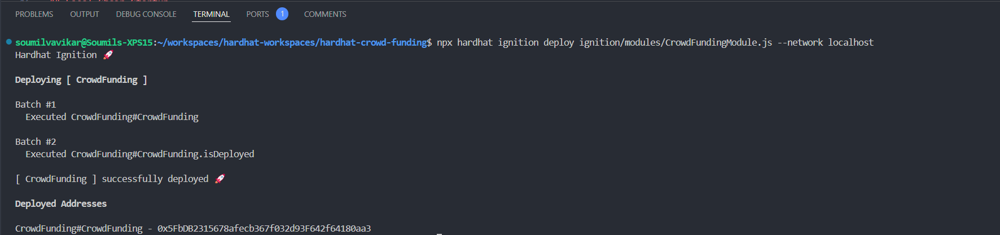
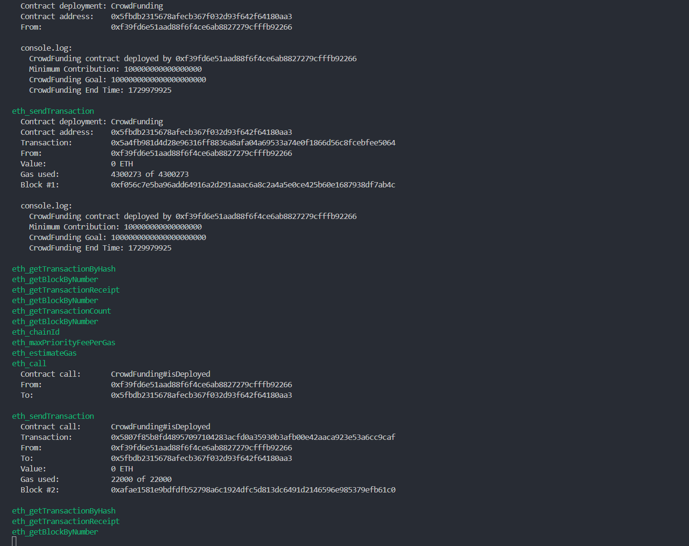

# Local Chain Startup and Deployment

## Commands

```shell
# Spin the local chain
npx hardhat node
# Deploy the contract / hardhat project
npx hardhat ignition deploy ignition/modules/CrowdFundingModule.js --network localhost

## NOTES:
### If in the above command, the --network localhost is not passed, then it by default deploys to local network.
### If you need to do multiple deployments of the contract use --deployment-id <unique-deployment-id> along with the command.
```

## Local Chain Startup

The logs of the local chain startup are captured in the [local-chain-startup-evidence.txt](txtfiles/local-chain-startup-evidence.txt) file.



## Crowd Funding Contract Deployment

The logs of the contract deployment are captured in the [contract-deploy-evidence.txt](txtfiles/contract-deploy-evidence.txt) file.




