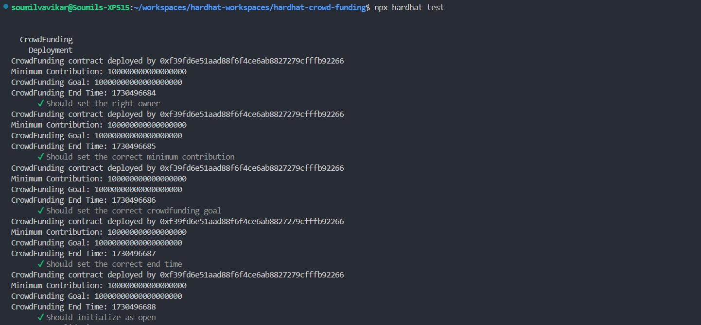
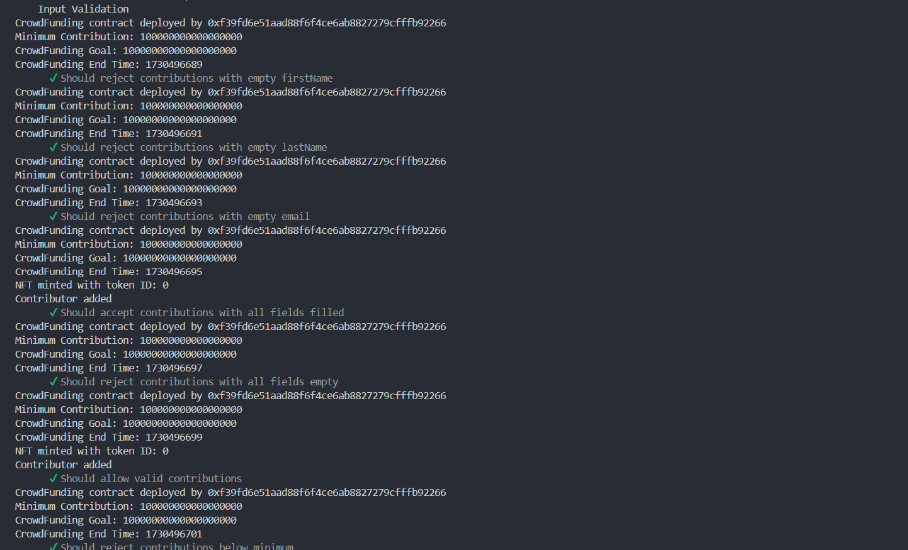
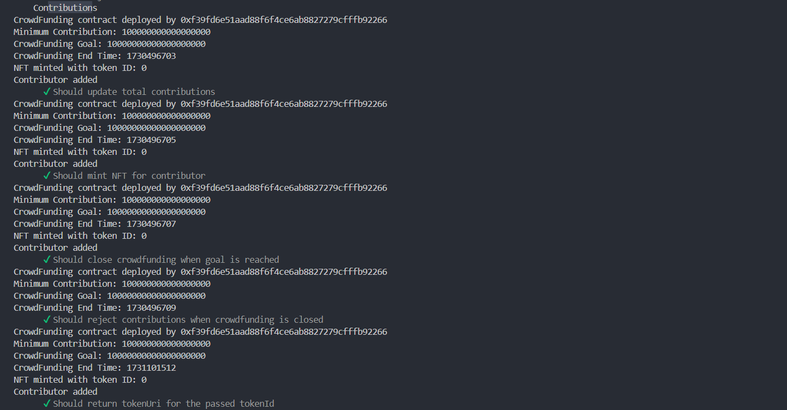
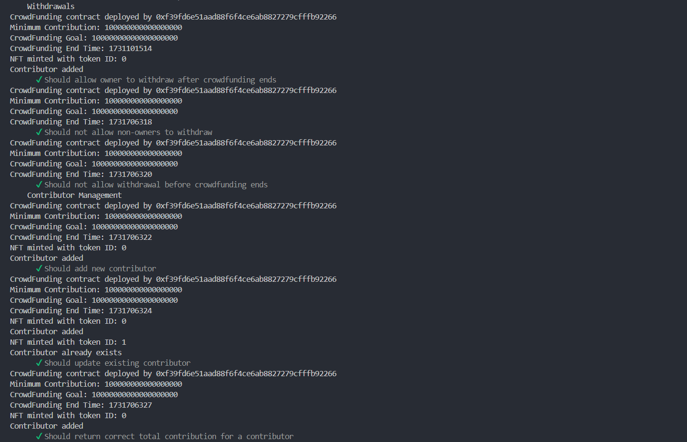
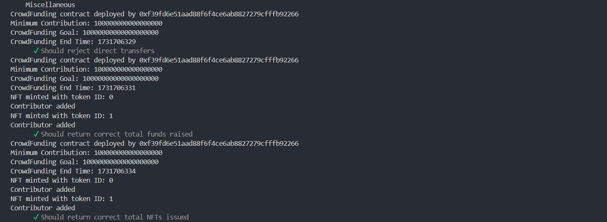
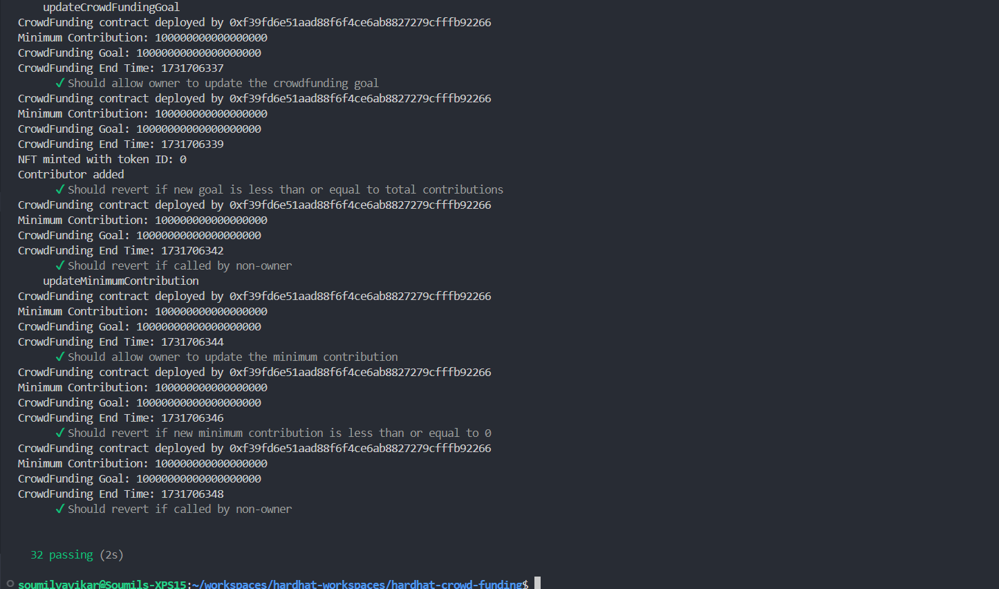

# Unit Testing Details

## Command

```shell
# Run the tests
npx hardhat test
```

## Evidences

The logs of the unit tests are captured in [unit-testing-evidence.txt](txtfiles/unit-testing-evidence.txt) file.

### Deployment



### Input Validation



### Contributions



### Withdrawls



### Miscellaneous



### Updating Crwod Funding


