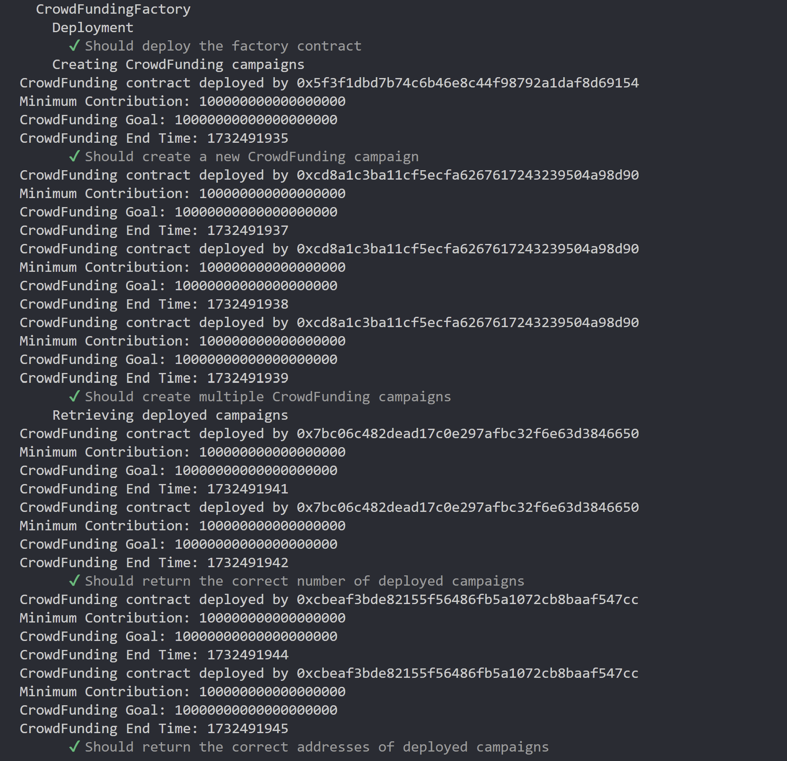

# Unit Testing Details

## Command

```shell
# Run the tests
npx hardhat test
```

## Evidences - Crowd Funding Contract

The logs of the unit tests are captured in [unit-testing-evidence.txt](txtfiles/unit-testing-evidence.txt) and [unit-testing-evidence-fac-contract.txt](testevidences/txtfiles/unit-testing-evidence-factory-included.txt) files.

### Deployment


### Input Validation


### Contributions


### Withdrawls


### Miscellaneous


### Updating Crwod Funding


## Evidences - Crowd Funding Factory Contract


